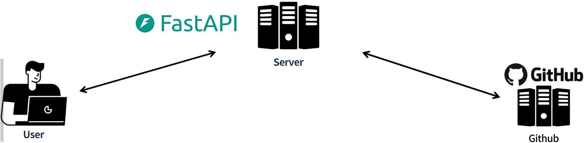
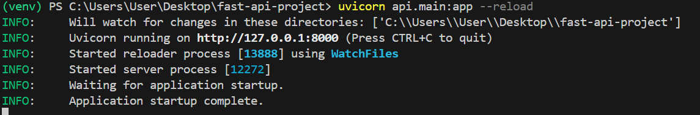
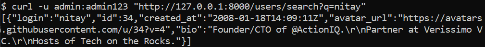
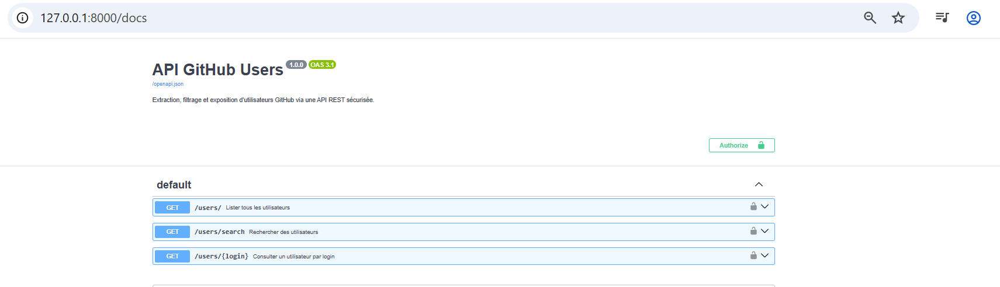
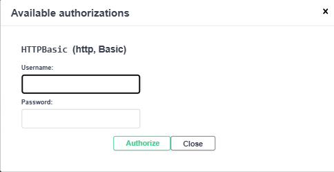
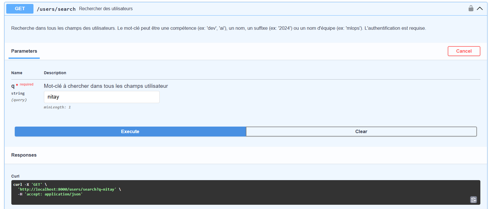
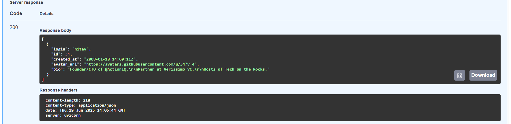
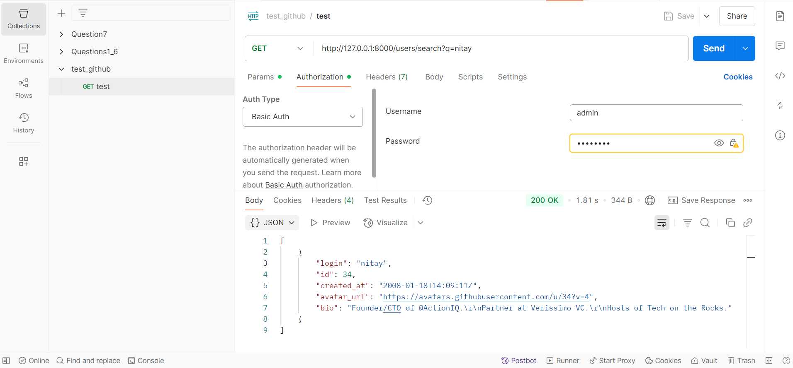
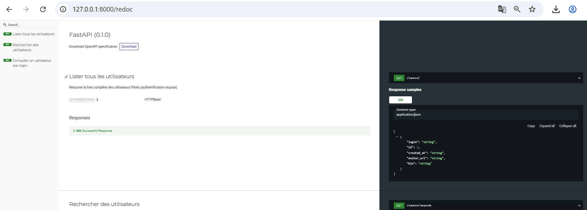

# **Extraction, filtrage et exposition d'utilisateurs GitHub via une API REST sécurisée.**

# Présentation du projet:

Ce projet a pour but de :

- Automatiser l’extraction de données à partir de l’API publique de GitHub.

- Structurer, filtrer et enrichir ces données pour les rendre exploitables.

- Exposer les résultats via une API REST sécurisée développée avec FastAPI, afin de permettre leur consommation par d'autres services ou applications.


# 🛠️ Technologies et outils

Langage : Python

API tierce : GitHub REST API 

Framework API : FastAPI

Sécurité : authentification HTTP Basic

Stockage : JSON 

Tests d'API : Requests / Postman / cURL

Documentation automatique : Swagger UI (généré par FastAPI)

# 📁 Structure du projet:


├── extract_users.py               # Script d'extraction depuis l’API GitHub

├── filtered_users.py              # Script de filtrage métier

├── data/

│   ├── users.json                 # Données brutes extraites

│   └── filtered_users.json        # Données nettoyées et filtrées

├── api/

│   ├── main.py                    # Lancement de l’API FastAPI

│   ├── models.py                  # Schémas Pydantic

│   ├── routes.py                  # Endpoints API

│   ├── security.py                # Gestion de l’authentification

├── tests/

│   └── test_api.py                # Tests d'API (utilisant requests)

├── requirements.txt              # Dépendances du projet

├── .env                          # Token GitHub & identifiants utilisateurs de l'API FastAPI 

└── README.md                     # Documentation complète du projet

# 🧩 Fonctionnement général

## Étape 1 — Extraction automatisée des utilisateurs GitHub via API publique

Le script extract_users.py a pour objectif d’extraire automatiquement des données d’utilisateurs depuis l’API publique de GitHub. Il interroge l’endpoint https://api.github.com/users?since=<id> pour récupérer les utilisateurs par lot. 

Pour fonctionner de manière fiable, il utilise un token personnel GitHub stocké dans un fichier .env, gère les limites de requêtes imposées par GitHub (quotas), assure une pagination fluide jusqu’à un nombre d’utilisateurs défini (ex. --max-users 120), et prend en charge les erreurs (403, 429, 5xx) sans interruption brutale.

Les données extraites sont enregistrées proprement dans un fichier JSON (`data/users.json`).

Exemple d'utilisation:
` python extract_users.py --max-users 1000 `


## Étape 2 — Structuration et filtrage des utilisateurs extraits 

Une fois de nombreux utilisateurs sont extraits depuis l’API GitHub et enregistrés, le script filtered_users.py:

- lit les données du fichier `users.json`,
- supprime les doublons,
- applique des filtres métiers simples,
- et enregistre un fichier nettoyé nommé `filtered_users.json`. 

Exemple d'utilisation:
` python filtered_users.py `

## Étape 3 — Création d’une API REST pour exposer les utilisateurs filtrés

Maintenant que les données ont été nettoyées et filtrées, l'API REST permet d’accéder à ces utilisateurs de manière sécurisée: de consulter la liste des utilisateurs, d’obtenir les détails d’un utilisateur spécifique, et d’effectuer des recherches par mot-clé.

Pour ce faire, **FastAPI** (un framework Python léger et moderne) est utilisé pour la création de l'API et ses fichiers dans le dossier api.

L’API est organisée en plusieurs modules (main.py, routes.py, models.py, security.py) pour garantir une structure claire et maintenable. Les données sont chargées une seule fois au démarrage depuis data/filtered_users.json. Trois routes principales sont exposées : /users/, /users/{login}, et /users/search?q=.... Toutes les routes sont protégées par une authentification HTTP Basic (via security.py), et FastAPI génère automatiquement une interface de documentation interactive (Swagger) à l’adresse http://localhost:8000/docs. Ce système permet de tester facilement les endpoints tout en garantissant un accès sécurisé et une réponse structurée en JSON.


L'API se lance avec la commande :

`uvicorn api.main:app --reload`



Exemple de requête à tester:




Ou tester via **Swagger UI**  accessible via http://127.0.0.1:8000/docs:




Il faut tout d'abord s'authentifier :





Puis tester l'une des routes disponibles:






Voilà aussi un test en utilisant **Postman**:





📝 Pour la Documentation, FastAPI propose également une autre version **ReDoc** accessible via 
http://127.0.0.1:8000/redoc

Elle est plus orientée lecture (moins interactive que Swagger UI).



# 🎯 Mot de fin

Ce projet illustre un pipeline complet de traitement de données, depuis l’extraction via une API tierce jusqu’à leur exposition via une API REST sécurisée. Il permet de manipuler des données réelles (utilisateurs GitHub), de les structurer, filtrer, puis de les exposer via FastAPI avec authentification.

📌 Il reste encore plusieurs pistes d’amélioration :

Ajouter des tests unitaires plus complets pour valider chaque étape du pipeline.

Implémenter une mise en cache ou une base de données pour éviter de charger l’ensemble des données en mémoire.

Mettre en place une actualisation automatique des données (extraction périodique).

🚀 Envie de contribuer ou d’échanger autour de ce projet ? N’hésitez pas à proposer une issue, une pull request, ou à me contacter pour toute collaboration !


📥 Voilà comment cloner ce projet :

```
git clone https://github.com/CSAADZIDI/Fast_api_project.git
cd Fast_api_project
```

N'oubliez pas d'installer les dépendances:

```
pip install -r requirements.txt
```

Lancez l'API avec la commande et enjoy !! :D

```
uvicorn api.main:app --reload
```